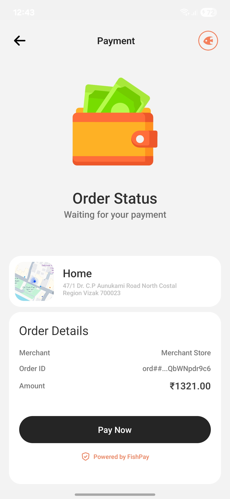
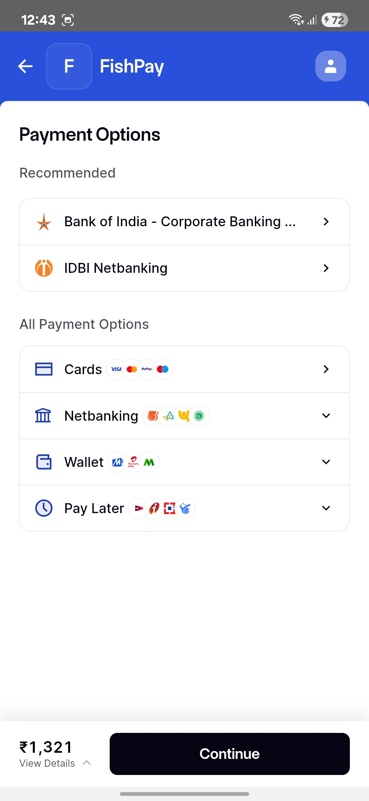
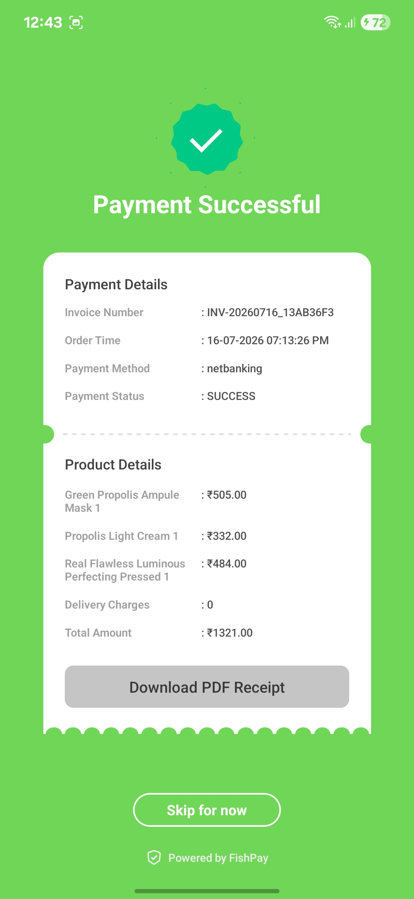
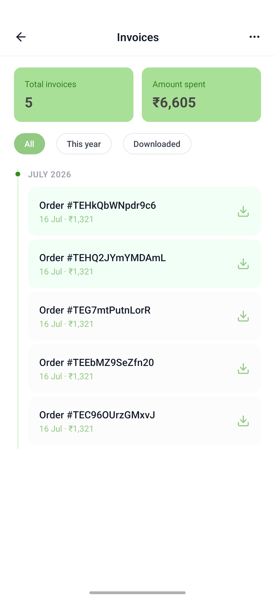

<p align="center">
  
</p>

# FishPay Frontend

## Merchant Payment Experience Demo (React Native Application)

FishPay Frontend is the demonstration mobile application for the FishPay payment platform. It allows merchants, vendors, recruiters, and evaluators to experience the complete customer payment journey before integrating the FishPay backend into their own applications.

Unlike the backend—which is the actual reusable payment infrastructure—this application acts as a showcase client demonstrating how merchants can integrate FishPay into their products with minimal effort.

---

**Product Selection & Payment Flow**

This application demonstrates the complete FishPay customer payment lifecycle, including secure payment processing, payment verification, transaction status, asynchronous invoice generation, invoice history, PDF downloads, and refund management. It serves as a demonstration client for merchants evaluating FishPay before integrating its backend into their own applications.

<br />
<br />

<p align="center">
  
  
  
  
</p>

---

**Invoice Management**

Every successful payment automatically generates a PDF invoice. Users can browse invoice history, identify unread invoices, mark invoices as viewed, and download invoice PDFs stored securely on Cloudinary.

**Refund Experience**

Customers can submit refund requests for eligible payments, monitor refund progress, and review previous refund records, demonstrating FishPay's complete refund lifecycle.

---

# ✨ Features

## 💳 Secure Payment Flow

* Razorpay Checkout integration
* Secure payment verification
* Payment success & failure handling
* Real-time payment status

## 🧾 Invoice Management

* Automatic invoice generation
* Invoice history
* Invoice viewed tracking
* PDF invoice download
* Cloudinary-hosted invoices

## 💰 Refund Experience

* Refund request
* Refund status tracking
* Refund history
* Merchant refund demonstration

## 📊 Transaction Overview

* Payment history
* Total invoice count
* Total amount spent
* Infinite scrolling transaction history

---

# 🧠 How FishPay Works (High Level)

1. Customer selects a product
2. Frontend requests a payment order
3. Razorpay Checkout processes payment
4. Backend verifies payment signature
5. Payment is stored securely
6. Invoice is generated asynchronously
7. PDF is uploaded to Cloudinary
8. Customer views invoices
9. Customer requests refunds (eligible payments)
10. Merchant processes refunds using FishPay APIs

---

# 🏗️ Architecture Overview

```text
React Native Mobile App
        |
        | REST APIs
        v
FishPay Backend (Spring Boot)
        |
        | Payment APIs
        v
Razorpay
        |
        v
PostgreSQL
        |
        v
Cloudinary
```

The frontend communicates only with the FishPay backend. All payment verification, invoice generation, refund processing, and transaction persistence are handled by the backend.

---

# 🛠️ Tech Stack

## 📱 Frontend

* React Native
* Expo Development Build
* TypeScript
* Redux Toolkit
* Axios
* React Navigation
* Expo File System
* Expo Sharing
* Expo AV
* Lottie Animations

---

# ⚙️ Setup & Installation (Local)

```bash
# Clone repository
git clone <FishPay_Frontend>

cd FishPay_Frontend

npm install

# Start Metro
npx expo start

# Android Development Build
npx expo run:android
```

Configure your environment variables before running the application.

Example:

```env
EXPO_PUBLIC_BASE_URL=
EXPO_PUBLIC_RAZORPAY_KEY_ID=
```

---

# 🚀 Usage

1. Launch the application
2. Browse available products
3. Complete payment using Razorpay
4. View generated invoices
5. Download invoice PDFs
6. Request refunds for eligible payments
7. Track refund status
8. Review refund history

---

# 🧩 Key Design Decisions

* React Native chosen for cross-platform mobile development
* Redux Toolkit used for centralized state management
* Axios for clean API abstraction
* Infinite scrolling for transaction history
* Asynchronous invoice generation with polling
* Backend-driven payment verification for security
* Frontend kept lightweight while business logic remains on the backend

---

# 📈 Performance Considerations

* Redux minimizes unnecessary API requests
* Pagination reduces initial loading time
* Async invoice generation improves payment response time
* Cloudinary provides reliable invoice delivery
* Centralized Axios instance simplifies API management

---

# 🛣️ Roadmap / Future Improvements

* Merchant dashboard integration
* Push notifications for payment & refund updates
* Transaction search & filtering
* Multi-payment gateway support
* Enhanced analytics
* Production monitoring integration
* Improved offline handling

---

# 📄 License

MIT License (to be finalized)

---

# 👤 Author

**Ravi Sharma**

Software Engineer | Full-Stack & Mobile Developer
